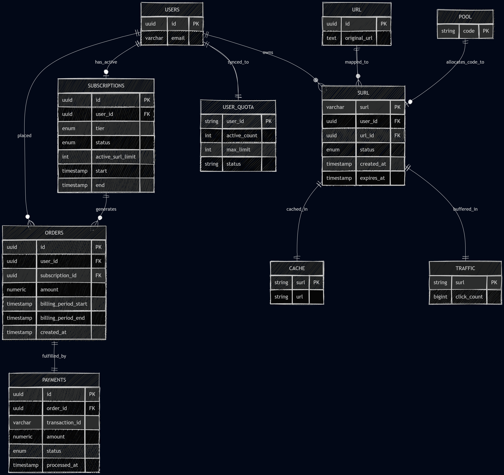

# Architecture Decision Records — ShortURL Backend

## SURL Generation Strategy

The system must convert a long URL into a Short URL (SURL).
The SURL must be unique, collision-resistant, and cheap to create.

### SURL length

Available symbols: `a-z` (26) + `A-Z` (26) + `0-9` (10) = 62 symbols.
Total number of SURL that can be created = 62n

| SURL Length | Approximate Capacity |
|:------------|:---------------------|
| **4**       | ~14.77 Million       |
| **5**       | ~916.13 Million      |
| **6**       | ~56.8 Billion        |
| **7** ✅     | **~3.52 Trillion**   |
| **8**       | ~218.34 Trillion     |
| **9**       | ~13.53 Quadrillion   |
| **10**      | ~839.30 Quadrillion  |

Length 7 has been selected as the optimal choice for the SURL system.

* **Capacity:** Provides over **3.52 trillion unique combinations**, ensuring the system won't run out of keys and
  be able to support millions of users.
* **Security:** The huge key space makes it nearly impossible for attackers to guess active links or scrape user data.
* **Optimal Shortness:** Adds massive security over a 6-character key while still staying short enough to remain
  practical when sharing with other people.
* **Key Generation:** low collision odds let the backend pre-generate random keys quickly without needing constant
  database checks.

### Generation

* **Pre-Generated SURL Pool:** A program constantly creating random SURLs and stores them in a Redis pool.
* **O(1):** When a user creates a short URL, the system instantly grabs a pre-generated SURL from Redis.
* **Collision:** Because 7 characters yield 3.52 trillion combinations, the generator practically never hits a duplicate
  key.

---

## SURL Lifecycle

Every SURL must be tied to an account for payments, abuse control, and lifecycle management (expiration, limits).

### Decision

- **Account creation is mandatory** before any SURL can be created.
- Every SURL carries: `owner_id`, `created_at`, `expires_at`, `status` (active/expired), and click metadata.
- Expiration and active-SURL-count limits are enforced **at write time** in the backend, based on the account's tier.
- A background task periodically scans for SURLs past `expires_at` and marks them expired/reclaims the SURL string
  back into the available pre-generated pool.

### Consequences

- **Pro:** Centralizes quota/expiry enforcement server-side, closing a common bypass vector (client-controlled limits).
- **Con:** Requires a scheduled job/worker process and adds operational surface area (must be idempotent, must handle
  backlog gracefully).

---

## Monetization

### Context

The payment model has not been decided yet, one or a combination of the models below are being considered.
**Subscription tiers** and **pay-per-SURL** one-time
payments.

| Plan                | Active SURL limit              | Validity duration                                                 | Enforcement point                                      |
|---------------------|--------------------------------|-------------------------------------------------------------------|--------------------------------------------------------|
| Free                | 1                              | Fixed, short (e.g., N days)                                       | On create will reject if users already has active SURL |
| Subscriber (tiered) | N tier-dependent               | Tied to subscription status; extends while subscription is active | On create and on subscription / subscription renewal   |
| Pay-per-use         | Unbounded, but priced per SURL | Chosen at purchase time                                           | On create will requires successful payment             |

- Pricing for pay-per-use is computed as a function of **(requested duration, current active-SURL count for that
  account)**.

---

## Dual-Tier Storage

SURL are extremely read heavy and latency sensitive, but traffic per SURL is highly irregular. Most SURLs get little
traffic, and a small number will get most of the traffic. A single database is either too slow for heavy traffic links
or too wasteful to keep everything.

- **Short-Term store** — Temporary, low-latency (key-value store), holds SURLs that are recently created
  or are currently experiencing high traffic.
- **Long-Term store** — Permanent, higher-latency, holds SURLs with lower level of traffic this is the permanent
  system of record.

**Placement:**

- Upon creation, every SURL is written to the **Short-Term** store first, assuming higher traffic closer to the date
  of creation.
- A background traffic management task will evaluate each SURL periodically:
    - **Low traffic** → SURL is moved into the Long-Term store;
    - **Rising or high traffic** → SURL is moved into the Short-Term store.

---

## Entities Model

